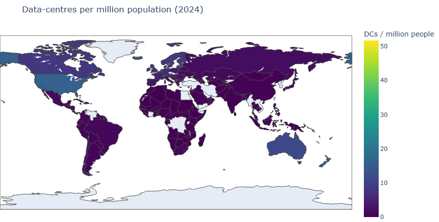
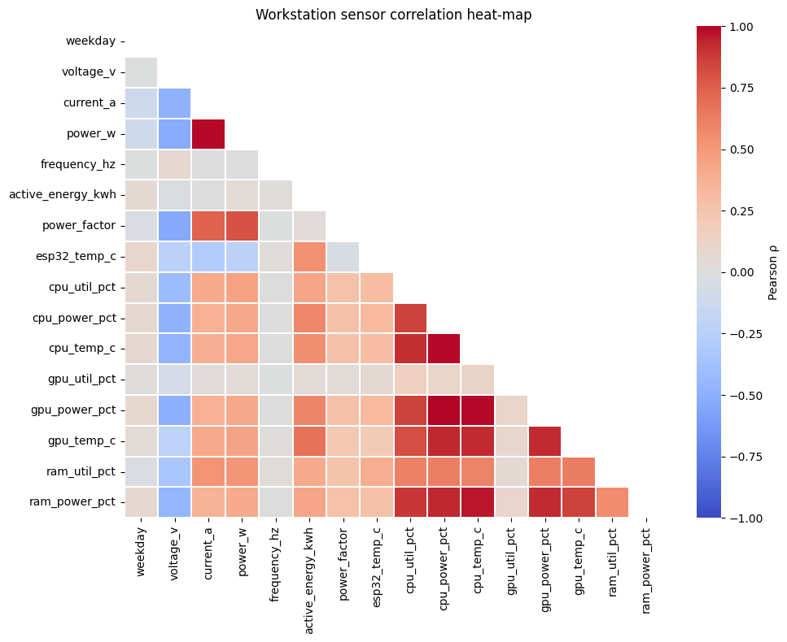
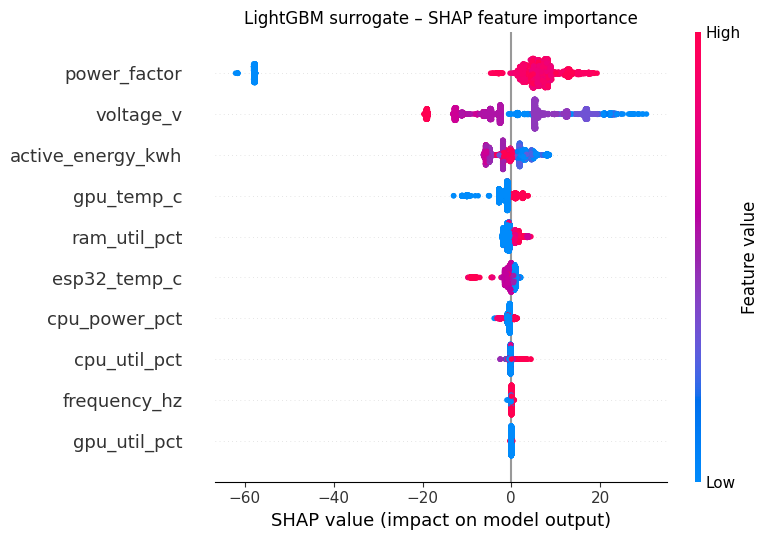
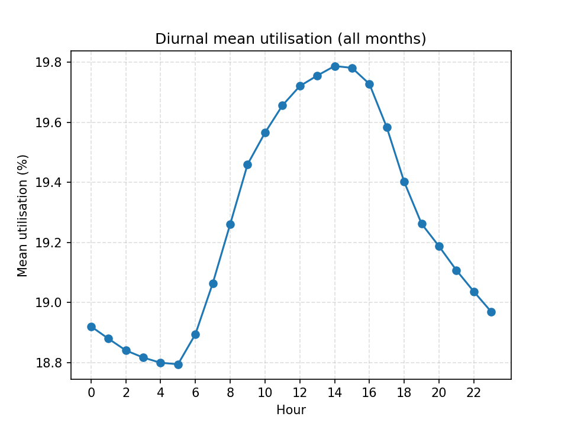

# Data Centres as Infrastructures of Power
### Energy, Inequality, and Discourse in the Cloud & AI Era


MSc dissertation project (University of Warwick, 2025) combining **web scraping, multi-source data engineering, geospatial & exploratory analysis, NLP sentiment mining, gradient-boosted surrogate modelling, and demand reconstruction** to study the energy footprint and public discourse around the world's data centres.

📄 Full write-up: [`docs/dissertation.pdf`](docs/dissertation.pdf) · All charts & tables: [`docs/analysis_visualisations_and_tables.docx`](docs/analysis_visualisations_and_tables.docx)

---

## Project pipeline

```
        ┌─────────────────────┐      ┌──────────────────────┐
        │ 01 Web scraper      │      │ Raw public datasets  │
        │ Cloudscene DC counts│      │ SEDS · UKPN · World  │
        │ (Aug 2025 snapshot) │      │ Bank · server logs   │
        └──────────┬──────────┘      └──────────┬───────────┘
                   └──────────┬─────────────────┘
                              ▼
                ┌───────────────────────────┐
                │ 02 Data cleaning / ETL    │  → tidy Parquet tables
                └─────────────┬─────────────┘     (data/processed)
              ┌───────────────┼────────────────────┐
              ▼               ▼                    ▼
    ┌──────────────┐  ┌──────────────────┐  ┌────────────────────┐
    │ 03 EDA &     │  │ 04–05 GDELT      │  │ 06 LightGBM        │
    │ geospatial   │  │ sentiment mining │  │ server-energy      │
    │ DC density   │  │ (2015–2025 news) │  │ surrogate model    │
    └──────────────┘  └──────────────────┘  └─────────┬──────────┘
                                                      ▼
                                     ┌────────────────────────────┐
                                     │ 07 UK demand reconstruction│
                                     │    from UKPN traces via    │
                                     │    single-server anchor    │
                                     └────────────────────────────┘
```

## What each notebook does

| # | Notebook | Description |
|---|----------|-------------|
| 01 | `01_cloudscene_country_scraper.ipynb` | Scrapes country-level data-centre counts from Cloudscene (snapshot: Aug 2025) into a tidy table used for global density analysis. |
| 02 | `02_data_cleaning.ipynb` | Cleans and standardises every raw source — US EIA SEDS state energy series (1930–2023), World Bank population/GDP, UKPN data-centre demand & utilisation feeds, 2021 server workstation telemetry logs — into tidy, typed Parquet tables. |
| 03 | `03_exploratory_data_analysis.ipynb` | Exploratory analysis: data-centres-per-capita by country, outlier handling, choropleth/Folium maps (see `visualisations/`), and US energy-consumption trend analysis. |
| 04 | `04_gdelt_sentiment_pipeline.ipynb` | Downloads & filters GDELT GKG v2 news records (2015–2025, sampled at regular intervals) for AI / cloud / data-centre coverage and computes tone series. |
| 05 | `05_gdelt_sentiment_local_models.ipynb` | Local sentiment modelling: filters Sentiment140 tweets, scores the GDELT sample, and builds the combined yearly sentiment series used in the discourse chapter. |
| 06 | `06_lightgbm_energy_surrogate.ipynb` | Trains and tunes a LightGBM surrogate that predicts server power draw from workstation telemetry (~4.4M rows). Saved models in `models/`. |
| 07 | `07_uk_datacentre_demand_scaling.ipynb` | Reconstructs absolute kW/kWh from UKPN percentage traces via a single-server anchor, classifies sites, and validates against implied servers-per-site. |

## Repository layout

```
├── src/dc_energy/    # Installable package: cleaners, density analysis, power anchors, LightGBM surrogate + CLI
├── tests/            # pytest suite (runs in CI against the bundled sample data)
├── notebooks/        # Ordered analysis pipeline (01 → 07)
├── data/
│   ├── processed/    # Tidy Parquet tables produced by notebook 02 (full files)
│   ├── samples/      # Samples of large raw inputs + small raw files (see data/README.md)
│   └── README.md     # Every data source, with download links & licensing notes
├── models/           # Tuned LightGBM surrogate model
├── outputs/          # Analysis outputs (UKPN utilisation profiles, DC density tables)
├── figures/          # All 30 write-up figures (analysis/) + notebook-extracted charts (notebooks/)
├── visualisations/   # Interactive HTML maps of global DC density per capita
└── docs/             # Dissertation PDF + full set of analysis tables & figures
```

## Selected figures

| | |
|---|---|
|  |  |
| *Data centres per million population (2024)* | *Workstation sensor correlation heat-map* |
|  |  |
| *LightGBM surrogate — SHAP feature importance* | *UKPN data-centre diurnal demand profile* |

The full set of 30 analysis figures is in [`figures/analysis/`](figures/analysis/) (captions and accompanying tables in [`docs/analysis_visualisations_and_tables.docx`](docs/analysis_visualisations_and_tables.docx)); charts extracted from notebook runs are in [`figures/notebooks/`](figures/notebooks/). Interactive Plotly/EDA charts don't render as static images — they live in the notebooks and the HTML maps below.

## Interactive visualisations

Open these directly in a browser (or via [htmlpreview.github.io](https://htmlpreview.github.io/)):

- `visualisations/dc_per_capita_2024_folium.html` — world map of data centres per capita (2024)
- `visualisations/dc_per_capita_2024_no_outliers.html` — same map, micro-state outliers removed
- `visualisations/dc_per_capita_no_top_3.html` — excluding the top-3 densest countries
- `visualisations/dc_per_capita.html` — base per-capita density view

## Data

Raw inputs total several GB, so this repo ships **full processed Parquet tables** (small) plus **representative samples** of the large raw files so every notebook can be inspected and partially re-run. `data/README.md` documents each source with download links so the full pipeline can be reproduced end-to-end.

> The GDELT cache (~5 GB of GKG zips) and full raw telemetry logs (~1.7 GB) are deliberately excluded; notebooks 04–05 re-download GDELT files on demand.

## Tech stack

`Python` · `pandas` · `NumPy` · `PyArrow` · `DuckDB` · `LightGBM` · `scikit-learn` · `Plotly` · `Folium` · `Matplotlib` · `BeautifulSoup` / `Selenium` / `Playwright` · `GDELT GKG v2`

## Setup

```bash
git clone <repo-url>
cd datacentre-energy-analytics
pip install -e ".[ml,dev]"
pytest                      # 16 tests, all runnable offline against bundled samples
```

The core pipeline logic lives in the installable `dc_energy` package with a CLI:

```bash
dc-energy clean-workstation data/samples/workstation_may_aug_2021_raw_SAMPLE.csv -o ws.parquet
dc-energy density data/processed/global_dc_counts_tidy.parquet data/processed/world_pop_long.parquet -o density.csv
dc-energy anchors data/samples/workstation_2021_may_aug_tidy_SAMPLE.parquet
dc-energy train data/samples/workstation_2021_may_aug_tidy_SAMPLE.parquet -o models/surrogate.txt
```

The notebooks (run in numerical order) document the full analysis narrative; notebooks 03 and 06–07 run against the bundled processed/sample data, while 01–02 and 04–05 need the raw sources listed in `data/README.md`.

## Author

**Pratik Bhala** — MSc, University of Warwick
Dissertation supervised by Asst. Prof. Dr. Ching
📧 pratikbhala1998@gmail.com
